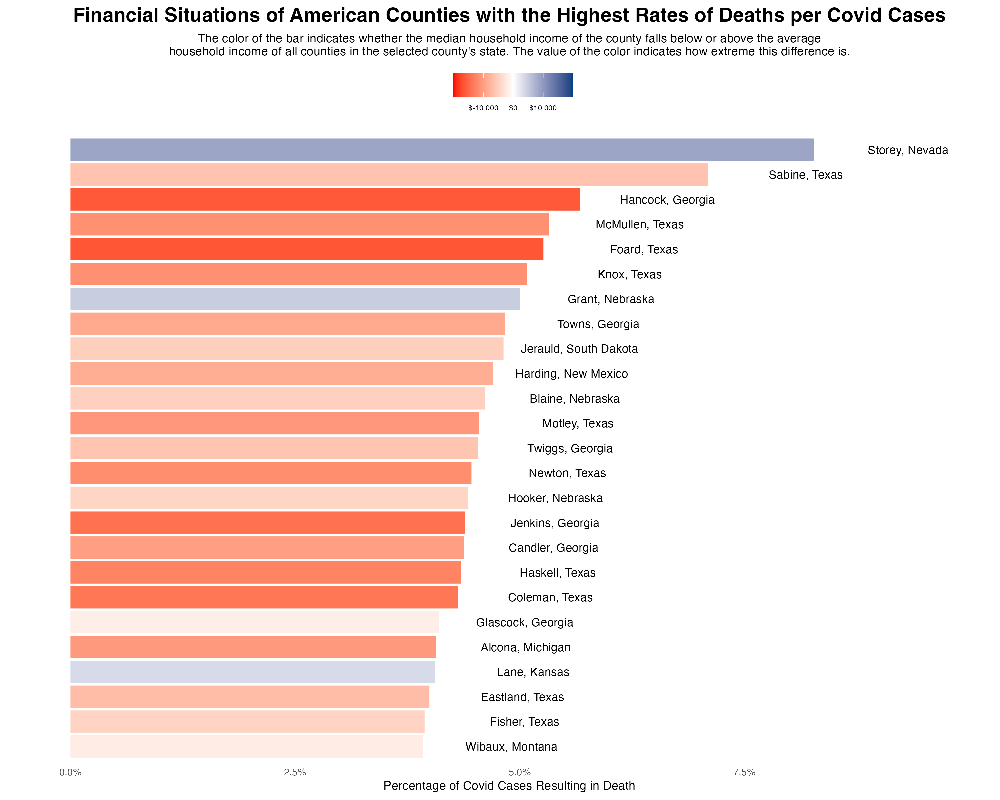

# Georgia Voting Analysis

## Overview

This project analyzes voting patterns across Georgia using Python and data visualization techniques. The goal is to explore how demographic and geographic factors relate to election outcomes through exploratory data analysis (EDA) and statistical summaries.

## Research Question

**How do demographic and geographic characteristics relate to voting outcomes across Georgia counties?**

## Features

* Cleaned and prepared election data for analysis
* Performed exploratory data analysis (EDA)
* Generated visualizations to identify voting trends
* Interpreted findings using statistical summaries
* Created a reproducible analysis workflow with Jupyter Notebook

## Technologies Used

* Python
* Pandas
* NumPy
* Matplotlib
* Seaborn
* Jupyter Notebook
* Git
* GitHub

## Project Structure

```text
georgia-voting-analysis/
│
├── data/
│   └── ...
├── figures/
│   └── visualizations.png
├── notebooks/
│   └── ...
├── README.md
└── requirements.txt
```

## Results

The visualization below summarizes the primary findings from the analysis.



## Skills Demonstrated

* Data Cleaning
* Exploratory Data Analysis (EDA)
* Statistical Analysis
* Data Visualization
* Research Documentation
* Version Control with Git
* Reproducible Data Science Workflows

## Future Work

* Analyze additional election cycles
* Incorporate socioeconomic and census variables
* Develop predictive machine learning models
* Build interactive dashboards with Plotly or Tableau

## Author

**Jason Gonzalez**

This project is part of my data science portfolio and demonstrates practical experience with Python, data analysis, and visualization techniques for research-oriented applications.
